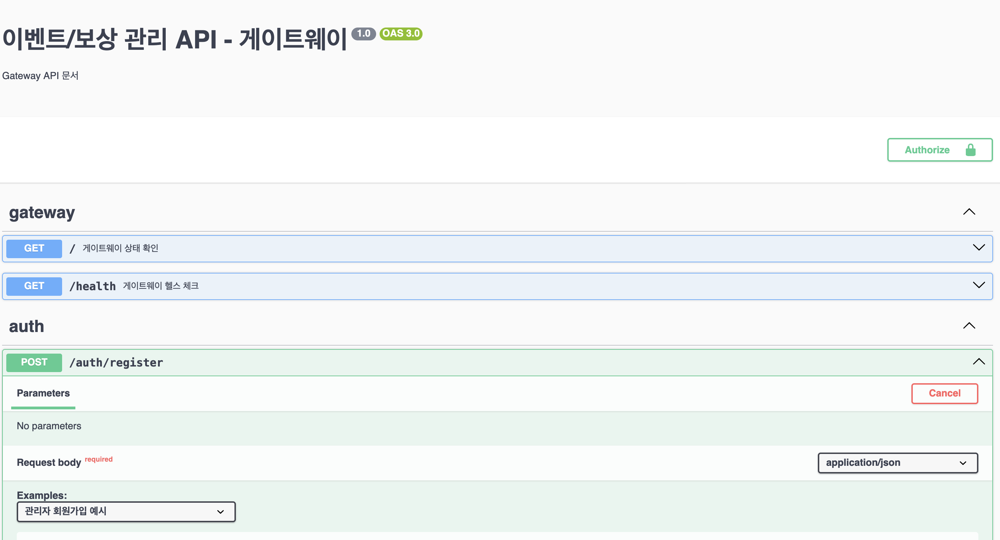

# 이벤트 & 보상 시스템

온라인 게임 또는 서비스에서 사용할 수 있는 이벤트 및 보상 관리 시스템입니다. 이 시스템은 마이크로서비스 아키텍처를 기반으로 설계되었으며, 다양한 이벤트 유형과 보상 처리 기능을 제공합니다. Swagger UI를 통해 API 문서화가 제공되어 쉽게 API를 테스트하고 사용할 수 있습니다.

## 시스템 개요

이 시스템은 세 가지 주요 서비스로 구성되어 있습니다:

1. **인증 서비스 (Auth Service)**: 사용자 인증, 권한 관리 및 접근 제어를 담당합니다.
2. **이벤트 서비스 (Event Service)**: 이벤트 관리, 조건 검증 및 보상 처리를 담당합니다.
3. **게이트웨이 서비스 (Gateway Service)**: 클라이언트와 내부 마이크로서비스 간의 통신을 중개합니다.

## 주요 기능

### 이벤트 관리
- 다양한 유형의 이벤트 생성, 수정, 삭제 기능 (출석 체크, 친구 초대, 보스 처치 등)
- 이벤트 상태 관리 (DRAFT, ACTIVE, ENDED, CANCELLED)
- 이벤트 참여 조건 검증
- 사용자별 이벤트 참여 현황 및 달성률 조회

### 보상 관리
- 다양한 유형의 보상 설정 (아이템, 쿠폰, 물리적 상품, 추첨)
- 사용자별 보상 요청 및 처리
- 보상 처리 상태 관리 (PENDING, PROCESSING, COMPLETED, REJECTED)

### 사용자 관리
- 역할 기반 접근 제어 (PLAYER, OPERATOR, ADMIN)
- JWT 기반 인증 및 인가
- 권한 검증

## 시스템 아키텍처

```
┌─────────────┐       ┌─────────────┐       ┌─────────────┐
│   Client    │───────▶  Gateway    │───────▶    Auth     │
└─────────────┘       │   Service   │       │   Service   │
                      └─────────────┘       └─────────────┘
                             │
                             ▼
                      ┌─────────────┐
                      |    Event    │
                      │   Service   │
                      └─────────────┘
```

## 설치 및 실행

### 요구사항
- Docker & Docker Compose
- Node.js 16.x 이상
- MongoDB

### 설치 방법

```bash
# 저장소 클론
git clone https://github.com/gkdis6/event.git
cd event

# 의존성 설치
npm install

# 운영용 환경 실행
docker-compose up -d

# 개발용 환경 실행
docker-compose -f docker-compose.dev.yml up -d
```

## API 엔드포인트

### 인증 관련 API
- `POST /auth/login`: 사용자 로그인
- `POST /auth/register`: 사용자 등록
- `GET /auth/profile`: 현재 로그인한 사용자 정보 조회

### 이벤트 관련 API
- `GET /events`: 이벤트 목록 조회
- `GET /events/:id`: 특정 이벤트 조회
- `POST /events`: 새 이벤트 생성 (OPERATOR, ADMIN 권한 필요)
- `PUT /events/:id`: 이벤트 정보 업데이트 (OPERATOR, ADMIN 권한 필요)
- `PUT /events/:id/status`: 이벤트 상태 변경 (OPERATOR, ADMIN 권한 필요)
- `DELETE /events/:id`: 이벤트 삭제 (ADMIN 권한 필요)
- `GET /events/participating`: 사용자가 참여 중인 이벤트 목록 조회

### 보상 관련 API
- `POST /events/:id/rewards/request`: 이벤트 보상 요청 (이벤트가 ACTIVE 상태일 때만 가능)
- `GET /events/rewards/requests`: 사용자의 보상 요청 목록 조회

## 주요 모듈

### 이벤트 조건 검증기
- `AttendanceDaysValidator`: 출석일 수 조건 검증
- `InviteFriendsValidator`: 친구 초대 수 조건 검증
- `PlayTimeValidator`: 플레이 시간 조건 검증
- `DefeatBossWeeklyValidator`: 주간 보스 처치 조건 검증
- `VipOnlyValidator`: VIP 전용 이벤트 조건 검증 (현재 주석 처리됨)

### 보상 처리기
- `ItemProcessor`: 게임 내 아이템 보상 처리
- `CouponInternalProcessor`: 내부 쿠폰 보상 처리
- `CouponExternalProcessor`: 외부 쿠폰 보상 처리
- `PhysicalProductProcessor`: 물리적 상품 보상 처리
- `LotteryProcessor`: 추첨 보상 처리

## API 문서화

시스템은 Swagger UI를 통해 API 문서화를 제공합니다. 각 API 엔드포인트에 대한 자세한 설명과 요청/응답 예시를 확인할 수 있습니다.

### Swagger UI 접근 방법
- Gateway 서비스: `http://localhost:3003/api`
- Auth 서비스: `http://localhost:3004/api`
- Event 서비스: `http://localhost:3005/api`

### Swagger에서 Bearer 토큰 설정하기
인증이 필요한 API를 테스트하기 위해서는 JWT 토큰을 설정해야 합니다. Swagger UI에서 다음과 같이 Bearer 토큰을 설정할 수 있습니다:

1. Swagger UI 페이지 상단의 "Authorize" 버튼 클릭
2. 표시되는 팝업 창에 `Bearer {your_token}` 형식으로 토큰 입력
   - 예: `Bearer eyJhbGciOiJIUzI1NiIsInR5cCI6IkpXVCJ9...`
3. "Authorize" 버튼 클릭하여 설정 완료
4. 이제 인증이 필요한 모든 API 요청에 자동으로 토큰이 포함됩니다



토큰은 `/auth/login` API를 호출하여 얻을 수 있습니다. 응답에서 받은 토큰을 복사하여 위 과정에 따라 설정하면 됩니다.

### Swagger를 통한 테스트 시나리오 (Gateway 서비스: `http://localhost:3003/api` 기반)

#### 시나리오 1: 사용자 등록 및 로그인
1. `POST /auth/register` API를 사용하여 새 사용자 등록
   ```json
   {
     "username": "testuser",
     "password": "password123",
     "email": "test@example.com",
     "role": "USER"
   }
   ```
2. `POST /auth/login` API를 사용하여 로그인하고 JWT 토큰 획득
   ```json
   {
     "username": "testuser",
     "password": "password123"
   }
   ```
3. 응답에서 받은 토큰을 Swagger Authorize 기능을 통해 설정

#### 시나리오 2: 이벤트 생성 및 관리 (관리자/운영자)
1. 관리자 계정으로 로그인하고 토큰 설정
2. `POST /events` API를 사용하여 새 이벤트 생성
   ```json
   {
     "title": "7일 연속 출석 이벤트",
     "description": "7일 연속 출석하면 특별 보상을 받을 수 있습니다!",
     "startDate": "2025-05-20T00:00:00.000Z",
     "endDate": "2025-06-20T23:59:59.999Z",
     "conditionType": "ATTENDANCE_DAYS",
     "conditionData": { "requiredDays": 7 },
     "status": "DRAFT"
   }
   ```
3. `GET /events` API를 사용하여 생성된 이벤트 확인
4. `PUT /events/{id}` API를 사용하여 이벤트 상태를 ACTIVE로 변경
   ```json
   {
     "status": "ACTIVE"
   }
   ```

#### 시나리오 3: 이벤트 참여 및 보상 요청 (일반 사용자)
1. 일반 사용자 계정으로 로그인하고 토큰 설정
2. `GET /events` API를 사용하여 활성화된 이벤트 목록 조회
3. `GET /events/participating` API를 사용하여 참여 중인 이벤트 확인
4. `POST /events/{id}/rewards/request` API를 사용하여 보상 요청
   ```json
   {
     "rewardId": "645f3c8b2c3f1a5e9b7d1e2f"
   }
   ```
5. `GET /events/rewards/requests` API를 사용하여 보상 요청 상태 확인

#### 시나리오 4: 보상 요청 처리 (관리자/운영자)
1. 관리자 계정으로 로그인하고 토큰 설정
2. `GET /events/rewards/requests` API를 사용하여 모든 보상 요청 목록 조회
3. `PUT /events/rewards/requests/{id}/status` API를 사용하여 보상 요청 상태 변경
   ```json
   {
     "status": "COMPLETED",
     "note": "2025-05-20 보상 지급 완료"
   }
   ```

### API 요청 예시
API 문서에는 다음과 같은 실제 요청 예시가 포함되어 있습니다:

#### 이벤트 생성 예시
```json
{
  "title": "7일 연속 출석 이벤트",
  "description": "7일 연속 출석하면 특별 보상을 받을 수 있습니다!",
  "startDate": "2025-05-20T00:00:00.000Z",
  "endDate": "2025-06-20T23:59:59.999Z",
  "conditionType": "ATTENDANCE_DAYS",
  "conditionData": { "requiredDays": 7 },
  "status": "DRAFT"
}
```

#### 보상 요청 예시
```json
{
  "rewardId": "645f3c8b2c3f1a5e9b7d1e2f"
}
```

## 트러블슈팅

### 권한 오류
권한 관련 오류가 발생하는 경우:
1. JWT 토큰이 유효한지 확인하세요.
2. 사용자에게 필요한 역할이 부여되었는지 확인하세요.
3. 게이트웨이 서비스와 인증 서비스 간 연결을 확인하세요.

### 이벤트 보상 요청 오류
보상 요청 시 오류가 발생하는 경우:
1. 이벤트가 ACTIVE 상태인지 확인하세요. (DRAFT, ENDED, CANCELLED 상태에서는 보상 요청 불가)
2. 유효한, 존재하는 보상 ID인지 확인하세요.
3. 사용자가 이미 동일한 보상을 요청했는지 확인하세요.

### 서비스 연결 오류
"connect ECONNREFUSED" 오류가 발생하는 경우:
1. 모든 서비스가 실행 중인지 확인하세요.
2. Docker 컨테이너 네트워크 설정을 확인하세요.
3. 서비스 간 호스트 이름이 올바르게 구성되었는지 확인하세요.
4. 환경 변수 설정이 올바른지 확인하세요 (AUTH_SERVICE_HOST, AUTH_SERVICE_PORT 등).

## 개발 가이드

### 새 조건 유형 추가
1. `event/src/common/enums/condition-type.enum.ts`에 새 조건 유형 추가
2. `event/src/conditions/validators/` 디렉토리에 새 검증기 클래스 구현
3. `event/src/conditions/factories/condition-validator.factory.ts`에 새 검증기 등록

### VIP_ONLY 조건 타입 정보
VIP_ONLY 조건 타입은 VIP 사용자만 참여할 수 있는 이벤트를 위해 구현되었습니다. 현재는 인증 서비스와의 연결 이슈로 인해 주석 처리되어 있습니다.

#### 구현 상태
- `VipOnlyValidator` 클래스는 구현되어 있으나 사용되지 않음
- `ConditionType.VIP_ONLY` enum 값은 주석 처리됨
- `ConditionValidatorFactory`에서 VIP_ONLY 케이스는 주석 처리됨

#### 활성화 방법
VIP_ONLY 조건 타입을 활성화하려면:
1. `event/src/common/enums/condition-type.enum.ts`에서 VIP_ONLY 주석 해제
2. `event/src/conditions/factories/condition-validator.factory.ts`에서 VIP_ONLY 케이스 주석 해제
3. 인증 서비스와의 연결 문제 해결 (AUTH_SERVICE_HOST, AUTH_SERVICE_PORT 환경 변수 확인)

### 새 보상 유형 추가
1. `event/src/common/enums/reward-type.enum.ts`에 새 보상 유형 추가
2. `event/src/rewards/processors/` 디렉토리에 새 처리기 클래스 구현
3. `event/src/rewards/factories/reward-processor.factory.ts`에 새 처리기 등록
